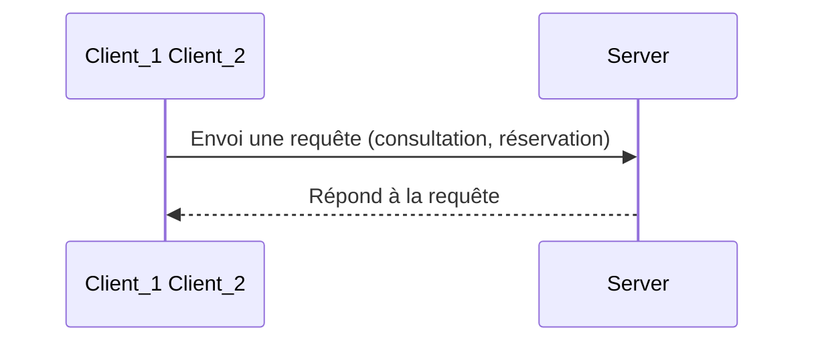
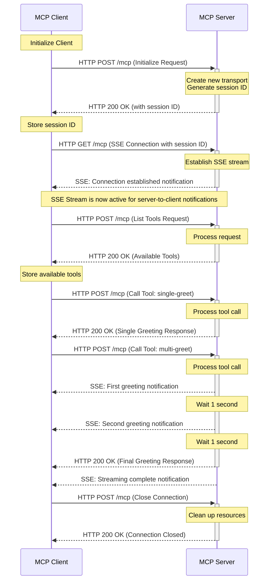

## Projet

Communication interprocessus entre un client et un serveur simple pour accomplir des tâches de consultation et de réservation.



```mermaid
graph LR
    subgraph Client
    F[Processus Fils]
    end
    
    subgraph Pipes
    P1[Tube P1: Requêtes]
    P2[Tube P2: Réponses]
    end
    
    subgraph Serveur
    P[Processus Père]
    end
    
    F -- write p1-1 --> P1 -- read p1-0 --> P
    P -- write p2-1 --> P2 -- read p2-0 --> F
 ```

## Contexte :

Durant notre licence en informatique, nous avons réalisé en binôme ce projet en langage en C, exécuté en ligne de commande. 


## Outils 
Le C montre les bases bas niveau (sockets, mémoire, protocole).


Le Java montre que tu sais industrialiser un service réseau. 👉 Présente ça comme : « même logique protocolaire, autre stack, plus orientée production ».


- Java 17
- Spring Boot
- API REST (consultation / réservation)
- Spring Boot (meilleur pour le web)
- architecture, API REST, config propre
Stack simple et propre :


Pas forcément de DB au début (ou H2)
- Hébergement (Render / / ) 
Très simple
Supporte Spring Boot 👉 le plus recommandé pour toi
🟡 Railway (

- Fly.io (Très bon mais quotas)


## Etape 1 : Mise en place en place d'une 1 ère communication client-serveur avec une communication inter-processus 

```mermaid

sequenceDiagram
    participant C as Client (Fils)
    participant S as Serveur (Père)
    
    Note over C,S: Initialisation: pipe() + fork()
    
    Note right of C: Menu & Saisie ID
    C->>S: write(p1[1], &choix) [ID Spectacle]
    S->>S: read(p1[0]) & Recherche places
    S->>C: write(p2[1], &nb_places) [Disponibilité]
    
    Note right of C: Saisie Réservation (ID + Quantité)
    C->>S: write(p1[1], &res)
    C->>S: write(p1[1], &nbp)
    
    alt Places suffisantes
        S->>S: Mise à jour tableau (nb_places -= nbp)
        S->>C: write(p2[1], "SUCCES")
    else Places insuffisantes
        S->>C: write(p2[1], "ECHEC")
    end
    
    Note over C: close() & exit()
    S->>S: wait(NULL)
    Note over S: close() & exit()
```


    
## Etape 2 : Implémentation des threads


Après avoir mise en place ue communication inter-processus par tubes avec des processus lourds, nous avons utilisées des threads pour répondre
à de nouvelles contraintes du cahier des charges de l'exercice.

L'avantage des threads est en effet la mémoire partagée qui permet aux processus de commmuniquer directement et rapidement sans objets complexes.
Cela nou a permis de simplifier l'échange de données par rapport à la première implémentation et première version que nous avions avec un échange avec un client et un serveur fils et père échangeant avec les tubes.

Ici, nous n'avons pas eu besoin de copie; En effet, chaque fichier a directement pris un rôle de client et de serveur en envoyant et réceptionnant les données dans une **communication bidirectionnelle**.


## Etape 3 : Manipulation des threads


Inconvénient : nécessite synchronisation (sémaphores).


## Etape 4 : Synchronisation des threads


## use cases




Plus “systèmes”, un peu plus technique (bien vu pour ton profil)
➡️ Render + Docker = énorme bonus DevOps.

4️⃣ Ce que ça montre pour les masters
Ça coche EXACTEMENT leurs attentes :

Réseau (client/serveur)
Systèmes (C)
Architecture applicative (Spring)
Déploiement (Docker + hébergeur)
Démarche personnelle (très apprécié)
👉 Dans ton dossier :

« Projet initial en C (client/serveur). Reprise volontaire en Java Spring Boot pour exposer le service via API REST et déploiement sur plateforme cloud. »


➡️ Fais-le en 2 étapes

### Etape 1 : Java Spring Boot local


### Etape 2 : Déploiement Render (+ Docker si possible)

l’architecture exacte
le plan de repo GitHub


### COnclusion
J'ai repris ce projet en Java Spring Boot pour exposer le service via API REST et le déploier une vraie plateformer afin de le tester en condititon réelle.


## Sources

https://www.freecodecamp.org/news/diagrams-as-code-with-mermaid-github-and-vs-code/
https://github.com/mermaid-js/mermaid/blob/develop/docs/syntax/entityRelationshipDiagram.md
https://github.com/mermaid-js/mermaid/blob/develop/README.md
