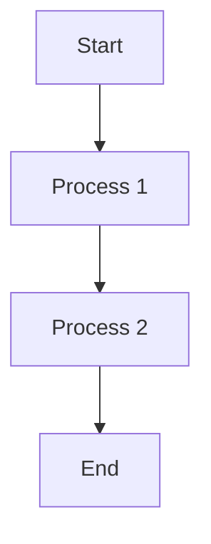

## Contexte du projet :

Communication interprocessus entre un client et un serveur simple pour accomplir des tâches de consultation et de réservation.

## Etape 1 : Traduction du C en Java

```mermaid
flowchart TD;
    A[Start] --> B[Process 1];
    B --> C[Process 2];
    C --> D[End];
```
