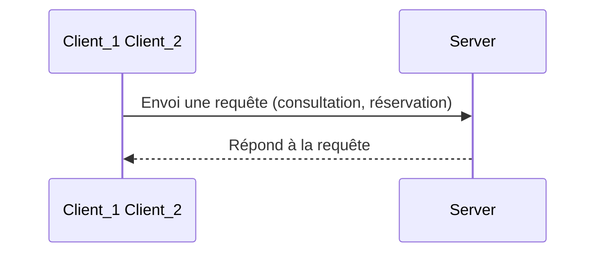
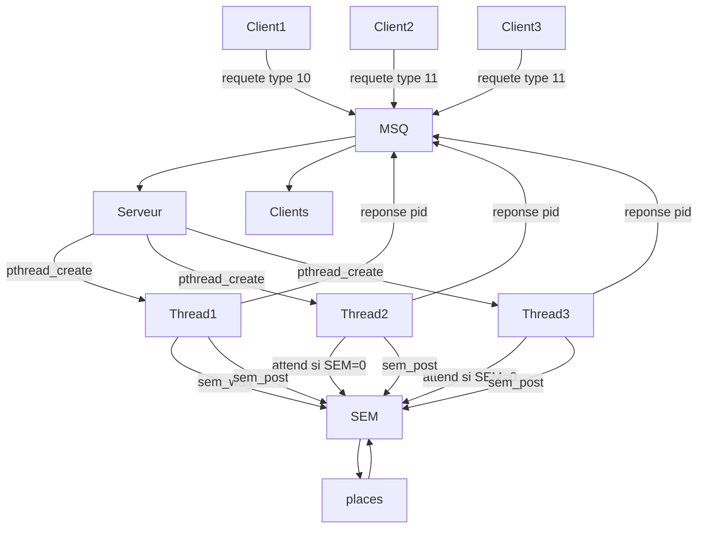
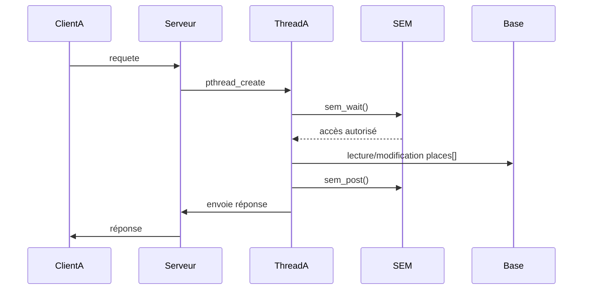
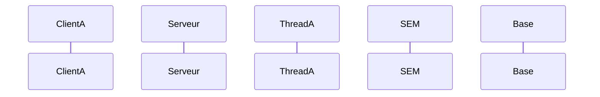

## Projet

Durant notre licence en informatique, nous avons réalisé en binôme ce projet en langage en C, exécuté en ligne de commande. 

Nous avons utilisé 3 outils de communication différents ce qui nous a permis de comprendre et prendre du recul sur quels mécanismes mettre en oeuvre lors des interactions client serveur.
&nbsp;

Chacunes des versions repose sur le modèle suivant :




# Communcation par Tubes Anonymes

## Etape 1 : Mise en place en place d'une 1 ère communication client-serveur avec une communication inter-processus 


```mermaid
graph LR
    subgraph Client
    F[Processus Fils]
    end
    
    subgraph Pipes
    P1[Tube P1: Requêtes]
    P2[Tube P2: Réponses]
    end
    
    subgraph Serveur
    P[Processus Père]
    end
    
    F -- write p1-1 --> P1 -- read p1-0 --> P
    P -- write p2-1 --> P2 -- read p2-0 --> F
 ```

```mermaid

sequenceDiagram
    participant C as Client (Fils)
    participant S as Serveur (Père)
    C->>S: ID Spectacle (Consultation)
    S->>C: Nb Places restantes
    C->>S: ID + Nb Places (Réservation)
    Note over S: Mise à jour tableau
    S->>C: Statut (SUCCES/ECHEC)
```
Communication interprocessus entre un client et un serveur simple pour accomplir des tâches de consultation et de réservation.


# Communcation par Files de Messages 

## Etape 2 : Implémentation des threads


Après avoir mise en place ue communication inter-processus par tubes avec des processus lourds, nous avons utilisées des threads pour répondre
à de nouvelles contraintes du cahier des charges de l'exercice.

L'avantage des threads est en effet la mémoire partagée qui permet aux processus de commmuniquer directement et rapidement sans objets complexes.
Cela nou a permis de simplifier l'échange de données par rapport à la première implémentation et première version que nous avions avec un échange avec un client et un serveur fils et père échangeant avec les tubes.

Ici, nous n'avons pas eu besoin de copie; En effet, chaque fichier a directement pris un rôle de client et de serveur en envoyant et réceptionnant les données dans une **communication bidirectionnelle**.


# Communcation multithread avec Files de Messages 

## Etape 3 : Traitement avec des threads spécialisés pour la consultation et la réservation

Inconvénient : nécessite synchronisation (sémaphores).


# Communcation multithread verrouillée par un Sémaphore
## Etape 4 : Synchronisation des threads










```mermaid
flowchart LR

    %% Clients
    C1[Client 1\n(pid = 1234)]
    C2[Client 2\n(pid = 5678)]

    %% File de messages
    MSQ[(Message Queue\nclé = 12)]

    %% Serveur (processus)
    subgraph SERVEUR [Processus Serveur]
        direction TB
        T1[Thread Consultation\nmsgrcv type = 11]
        T2[Thread Réservation\nmsgrcv type = 2]
        DATA[Tableau places[3]\n{50,30,20}]
    end

    %% Envois vers MSQ
    C1 -- requête consultation\n(type 11) --> MSQ
    C2 -- requête réservation\n(type 2) --> MSQ

    %% MSQ vers threads
    MSQ -- type 11 --> T1
    MSQ -- type 2 --> T2

    %% Accès aux données partagées
    T1 --> DATA
    T2 --> DATA

    %% Réponses
    T1 -- réponse\n(type = pid client) --> MSQ
    T2 -- réponse\n(type = pid client) --> MSQ

    MSQ --> C1
    MSQ --> C2

```
    

## Sources

https://www.freecodecamp.org/news/diagrams-as-code-with-mermaid-github-and-vs-code/
https://github.com/mermaid-js/mermaid/blob/develop/docs/syntax/entityRelationshipDiagram.md
https://github.com/mermaid-js/mermaid/blob/develop/README.md
