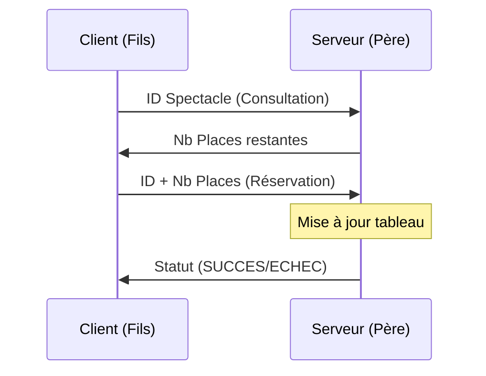
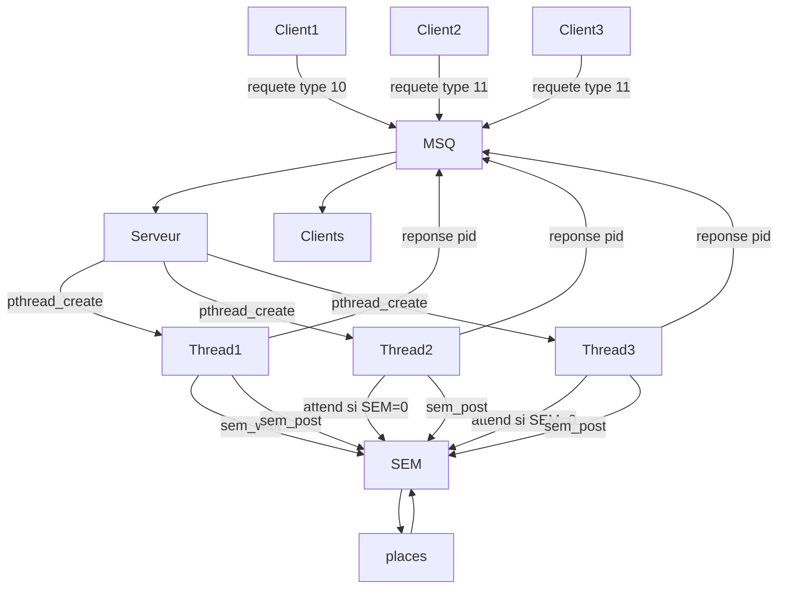
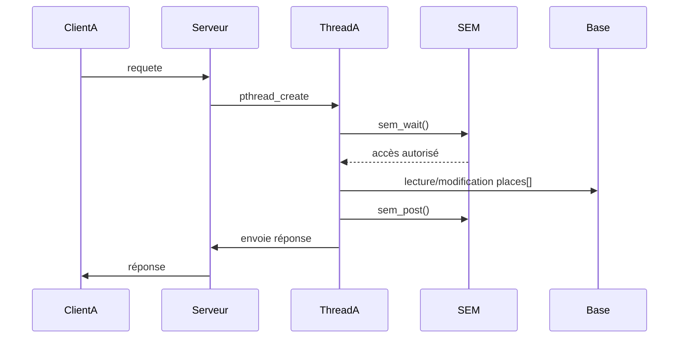
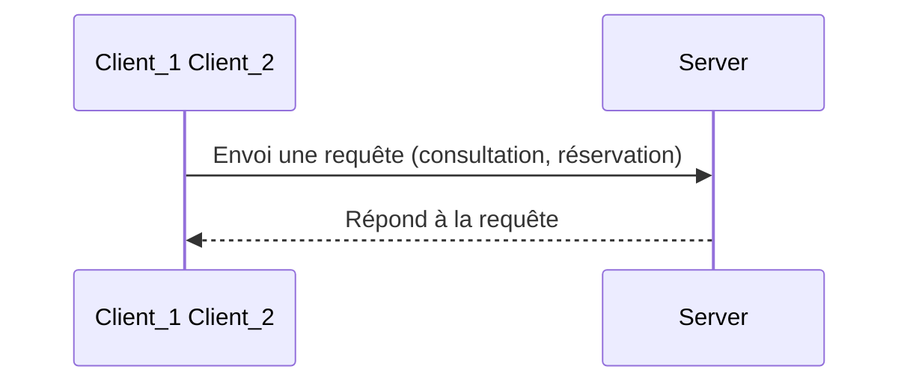

## Projet

Durant notre licence en informatique, nous avons réalisé en binôme ce projet en langage en C, exécuté en ligne de commande. 


# Communcation par Tubes Anonymes

## Etape 1 : Mise en place en place d'une 1 ère communication client-serveur avec une communication inter-processus 



Communication interprocessus entre un client et un serveur simple pour accomplir des tâches de consultation et de réservation.


# Communcation par Files de Messages 


# Communcation multithread avec Files de Messages 


# Communcation multithread verrouillée par un Sémaphore







```mermaid
flowchart LR

    %% Clients
    C1[Client 1\n(pid = 1234)]
    C2[Client 2\n(pid = 5678)]

    %% File de messages
    MSQ[(Message Queue\nclé = 12)]

    %% Serveur (processus)
    subgraph SERVEUR [Processus Serveur]
        direction TB
        T1[Thread Consultation\nmsgrcv type = 11]
        T2[Thread Réservation\nmsgrcv type = 2]
        DATA[Tableau places[3]\n{50,30,20}]
    end

    %% Envois vers MSQ
    C1 -- requête consultation\n(type 11) --> MSQ
    C2 -- requête réservation\n(type 2) --> MSQ

    %% MSQ vers threads
    MSQ -- type 11 --> T1
    MSQ -- type 2 --> T2

    %% Accès aux données partagées
    T1 --> DATA
    T2 --> DATA

    %% Réponses
    T1 -- réponse\n(type = pid client) --> MSQ
    T2 -- réponse\n(type = pid client) --> MSQ

    MSQ --> C1
    MSQ --> C2

```
    


```mermaid
graph LR
    subgraph Client
    F[Processus Fils]
    end
    
    subgraph Pipes
    P1[Tube P1: Requêtes]
    P2[Tube P2: Réponses]
    end
    
    subgraph Serveur
    P[Processus Père]
    end
    
    F -- write p1-1 --> P1 -- read p1-0 --> P
    P -- write p2-1 --> P2 -- read p2-0 --> F
 ```


    
## Etape 2 : Implémentation des threads


Après avoir mise en place ue communication inter-processus par tubes avec des processus lourds, nous avons utilisées des threads pour répondre
à de nouvelles contraintes du cahier des charges de l'exercice.

L'avantage des threads est en effet la mémoire partagée qui permet aux processus de commmuniquer directement et rapidement sans objets complexes.
Cela nou a permis de simplifier l'échange de données par rapport à la première implémentation et première version que nous avions avec un échange avec un client et un serveur fils et père échangeant avec les tubes.

Ici, nous n'avons pas eu besoin de copie; En effet, chaque fichier a directement pris un rôle de client et de serveur en envoyant et réceptionnant les données dans une **communication bidirectionnelle**.


## Etape 3 : Manipulation des threads


Inconvénient : nécessite synchronisation (sémaphores).


## Etape 4 : Synchronisation des threads


## use cases


```mermaid
sequenceDiagram
    participant Client as MCP Client
    participant Server as MCP Server
    
    Note over Client: Initialize Client
    
    Client->>+Server: HTTP POST /mcp (Initialize Request)
    Note over Server: Create new transport<br/>Generate session ID
    Server-->>-Client: HTTP 200 OK (with session ID)
    
    Note over Client: Store session ID
    
    Client->>+Server: HTTP GET /mcp (SSE Connection with session ID)
    Note over Server: Establish SSE stream
    Server-->>-Client: SSE: Connection established notification
    
    Note over Client,Server: SSE Stream is now active for server-to-client notifications
    
    Client->>+Server: HTTP POST /mcp (List Tools Request)
    Note over Server: Process request
    Server-->>-Client: HTTP 200 OK (Available Tools)
    
    Note over Client: Store available tools
    
    Client->>+Server: HTTP POST /mcp (Call Tool: single-greet)
    Note over Server: Process tool call
    Server-->>-Client: HTTP 200 OK (Single Greeting Response)
    
    Client->>+Server: HTTP POST /mcp (Call Tool: multi-greet)
    Note over Server: Process tool call
    
    Server-->>Client: SSE: First greeting notification
    Note over Server: Wait 1 second
    Server-->>Client: SSE: Second greeting notification
    Note over Server: Wait 1 second
    
    Server-->>-Client: HTTP 200 OK (Final Greeting Response)
    Server-->>Client: SSE: Streaming complete notification
    
    Client->>+Server: HTTP POST /mcp (Close Connection)
    Note over Server: Clean up resources
    Server-->>-Client: HTTP 200 OK (Connection Closed)

```

Plus “systèmes”, un peu plus technique (bien vu pour ton profil)
➡️ Render + Docker = énorme bonus DevOps.

4️⃣ Ce que ça montre pour les masters
Ça coche EXACTEMENT leurs attentes :

Réseau (client/serveur)
Systèmes (C)
Architecture applicative (Spring)
Déploiement (Docker + hébergeur)
Démarche personnelle (très apprécié)
👉 Dans ton dossier :

« Projet initial en C (client/serveur). Reprise volontaire en Java Spring Boot pour exposer le service via API REST et déploiement sur plateforme cloud. »


➡️ Fais-le en 2 étapes

### Etape 1 : Java Spring Boot local


### Etape 2 : Déploiement Render (+ Docker si possible)

l’architecture exacte
le plan de repo GitHub


### COnclusion
J'ai repris ce projet en Java Spring Boot pour exposer le service via API REST et le déploier une vraie plateformer afin de le tester en condititon réelle.


## Sources

https://www.freecodecamp.org/news/diagrams-as-code-with-mermaid-github-and-vs-code/
https://github.com/mermaid-js/mermaid/blob/develop/docs/syntax/entityRelationshipDiagram.md
https://github.com/mermaid-js/mermaid/blob/develop/README.md
