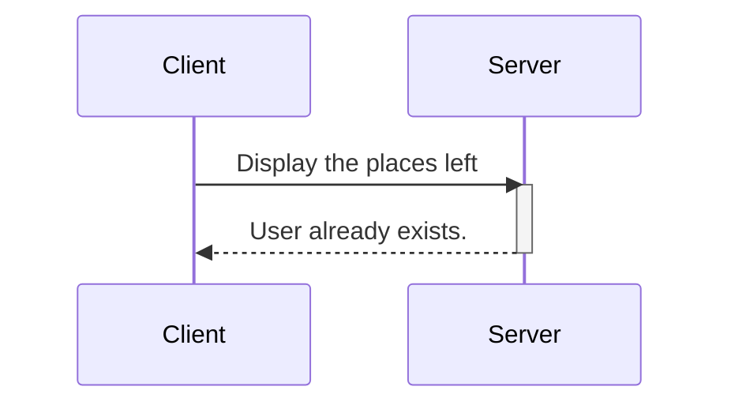

## Contexte du projet :


Communication interprocessus entre un client et un serveur simple pour accomplir des tâches de consultation et de réservation.


```mermaid
sequenceDiagram
    participant Client
    participant Server
    Client->>Server:  Display the places left
    Client<<-Server:  Display the places left


```


## Etape 1 : Traduction du C en Java


## use cases





## Sources

https://www.freecodecamp.org/news/diagrams-as-code-with-mermaid-github-and-vs-code/
